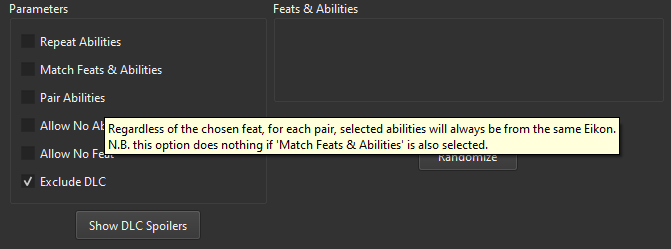

# Loadout Randomizer

Loadout Randomizer is randomization tool built in Python. It contains all
necessary data to randomly select a full loadout for **Final Fantasy XVI**,
including all available *Eikonic Feats & Abilities*.

* This does not select equipment, weapons or accessories.
* Includes all relevant data from *The Rising Tide* DLC, but automatically
hides and excludes all spoilers for said DLC.
* Also randomly selects the order for each of the three randomly chosen
sets of *Eikonic Feats & Abilities*.
* Various parameters to determine how each loadout is generated.
* Include and exclude specific *Eikons* freely by clicking their icon.

  

**Parameters**
* Repeat Abilities (initially unselected)
* Match Feats & Abilities (initially unselected)
* Pair Abilities (initially unselected)
* Allow No Ability (initially unselected)
* Allow No Feat (initially unselected)
* Exclude DLC (initially selected)

Each available parameter also contains a brief explanation on how it works
or why you might use it. You can access these tooltips simply by hovering
your mouse over them.

  

*N.B.* This application does not work directly with **Playstation Remote Play**

## How It Works

Each release of Loadout Randomizer contains both a zip with the compiled
executable and a zip of the full source code.

If you have no experience with programming, then download the latest
`Release.zip`folder here, extract the files and simply run the
`randomizer.exe`file inside.

If you would like to download, build and/or modify the code yourself
then you can also do so from the releases page or from the `main` branch
of the repository as per usual.

1. Loadout Randomizer contains three python classes, each in it's own
seperate file, various image assets, and a `.txt`file containing the
necessary *Eikon* data.
3. Go to your preferred terminal and `pip install PyQt6`. This is the
only package you'll need that isn't already pre-packaged with Python 3.
4. Run the `pyqt_gui.py`file in the root directory in your preferred
terminal or IDE to start the application.

### How to Build

If you want to build it yourself:
1. Download and install the latest version of **Python 3**.
2. `pip install pyinstaller`
3. `pyinstaller pyqt_gui.spec`
4. The working executable is available in the `/dist/pyqt_gui/`directory.
The `_internal`directory contains all the necessary files and packages.

## That's it!

It's a very simple application on the front, but the various
features all interact with each other in specific ways which makes it
a bit more complex than it might seem.